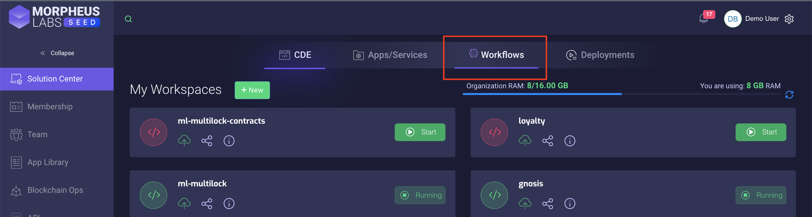
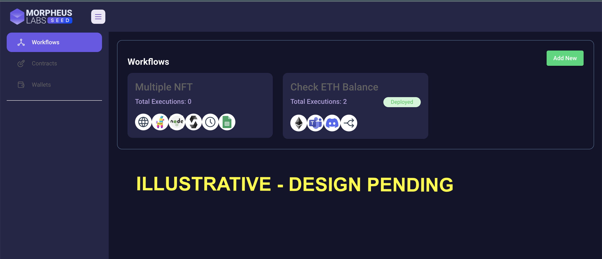

<!-- markdownlint-disable MD030 -->

# ML SEED Workflows - A Morpheus Labs SEED solution to Automate Web3 and Web2 applications

The ML SEED Workflowas is the version optimized for enterprize use intgrated with Morpheus Labs SEED for code/no code workflow automation Web3 applications and not only, focusing on integrating both on-chain and off-chain applications.






# README OF ORIGINGAL PROJECT ---> TO BE UPDATED GRADUALLY

## 💡Why another workflow automation tool?

There are many awesome automation tools out there, however there isn't one that has the built-in logic of interacting/consuming information from blockchains. Hence, Outerbridge is created to allow people building workflows involving on-chain and off-chain applications, with simple drag and drop interface.

## 💻 Demo

-   [Public demo](https://demo.outerbridge.io) version of Outerbridge.

-   Watch [Outerbridge Quickstart Demo](https://www.youtube.com/watch?v=x-AfrkKvZ4M) on Youtube (4mins)

## ⚡Quick Start

1. Install MongoDB from [here](https://www.mongodb.com/try/download/community?tck=docs_server).
2. `npm install -g outerbridge`
3. `npx outerbridge start`
4. Open [http://localhost:3000](http://localhost:3000)

## 🐳 Docker

1. Go to `docker` folder at the root of the project
2. `docker-compose up -d`
3. This will automatically spins up mongodb and outerbridge containers
4. Open [http://localhost:3000](http://localhost:3000)
5. You can bring the containers down by `docker-compose stop`

## 👨‍💻 Developers

Outerbridge has 3 different modules in a single mono repository.

-   `server`: Node backend to serve API logics
-   `ui`: React frontend
-   `components`: Nodes and Credentials of applications

### Prerequisite

`MongoDB` and `Yarn` have to be installed before setting up the project.

### MongoDB

Outerbridge uses MongoDB as database. Download and install one [here](https://www.mongodb.com/try/download/community?tck=docs_server).

### Yarn

```bash
npm i -g yarn
```

### Setup

1. Clone the repository

    ```bash
    git clone https://github.com/Outerbridgeio/Outerbridge.git
    ```

2. Go into repository folder

    ```bash
    cd Outerbridge
    ```

3. Install `lerna`, `husky` and `rimraf` :

    ```bash
    yarn setup
    ```

4. Install all dependencies of all modules and link them together:

    ```bash
    yarn bootstrap
    ```

5. Build all the code:

    ```bash
    yarn build
    ```

6. Start the app:

    ```bash
    yarn start
    ```

    You can now access the app on [http://localhost:3000](http://localhost:3000)

7. For development build:

    ```bash
    yarn dev
    ```

    Any code changes will reload the app automatically on [http://localhost:8080](http://localhost:8080)

## 📖 Documentation

Official Outerbridge docs can be found under: [https://docs.outerbridge.io](https://docs.outerbridge.io)

## 🌐 Host

-   Digital Ocean Droplet: [Setup guide](https://gist.github.com/HenryHengZJ/93210d43d655b4172ee50794ce473b62)
-   AWS EC2: [Setup guide](https://gist.github.com/HenryHengZJ/627cec19671664a88754c7e383232dc8)

## 🙋 Support

Feel free to ask any questions, raise problems, and request new features in [discussion](https://github.com/Outerbridgeio/Outerbridge/discussions)

## 🙌 Contributing

See [contributing guide](CONTRIBUTING.md). Reach out to us at [Discord](https://discord.gg/Y9VE4ykPDJ) if you have any questions or issues.

## 📄 License

Source code in this repository is made available under the [Apache License Version 2.0](LICENSE.md).
